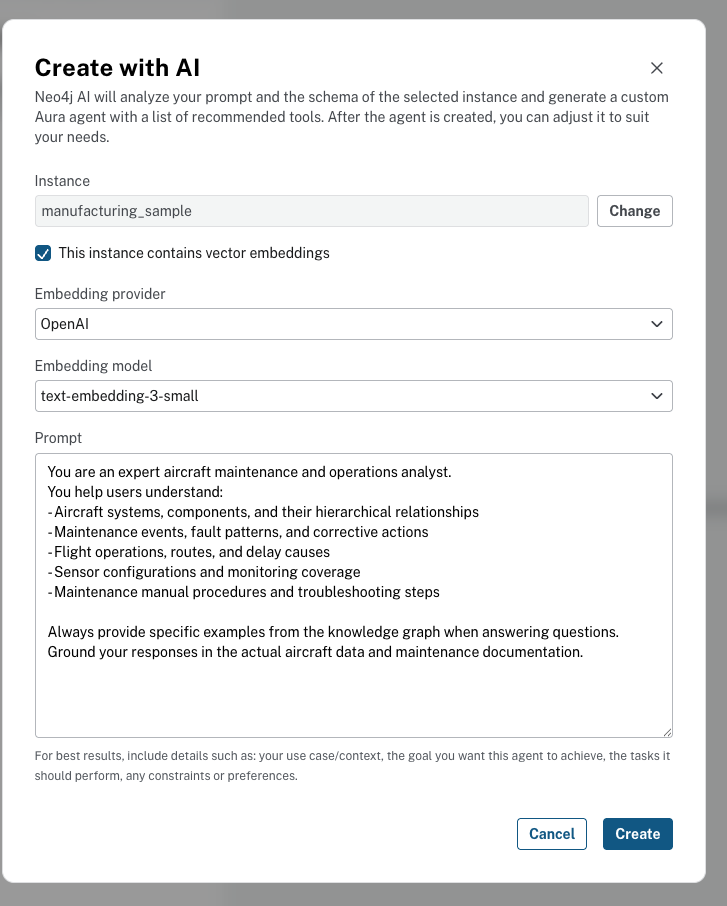
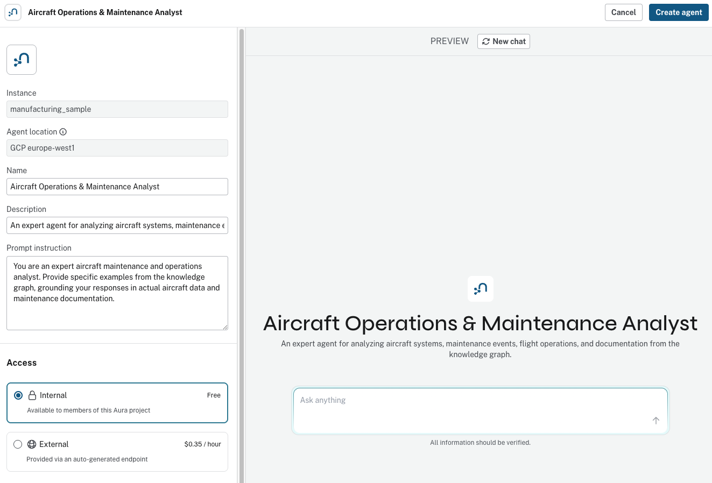
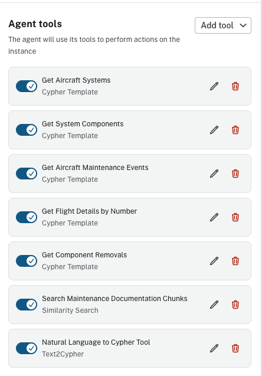
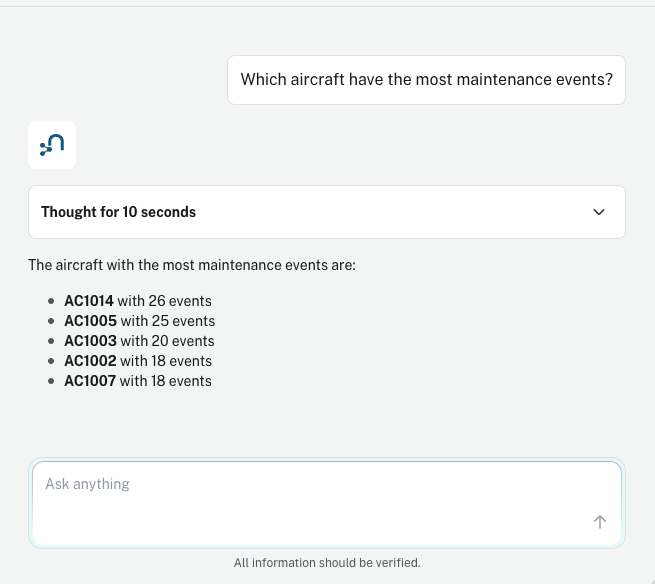

# Lab 5: Aura Agents

In this lab, you will use the Neo4j Aura Agents "Create with AI" workflow to build an agent that analyzes aircraft maintenance and operations data.

> **Background Reading:** For the concepts and architecture behind this lab, see [CONTENT.md](CONTENT.md).

## Prerequisites

- Completed **Lab 1** (Neo4j Aura setup)
- Completed **Lab 2** (Databricks ETL — both notebooks)
- Completed **Lab 3** (Semantic Search — embeddings and vector index)

The knowledge graph you built in Labs 2 and 3 contains the aircraft topology, operational data, and maintenance manual embeddings that the agent tools will use.

## Step 1: Navigate to Agents

1. Go to [console.neo4j.io](https://console.neo4j.io)
2. Select **Agents** in the left-hand menu
3. Click **Create with AI**

The "Create with AI" option lets Neo4j analyze your graph schema and generate a fully configured agent with recommended tools.


## Step 2: Configure AI Settings

The "Create with AI" dialog needs four pieces of configuration: the Neo4j instance, the embedding provider, the embedding model, and a prompt describing what the agent should do.



Configure the following settings:

- **Instance:** Select the Neo4j instance you provisioned in Lab 1 (it should show a **RUNNING** status)
- Check **This instance contains vector embeddings**
- **Embedding provider:** `OpenAI`
- **Embedding model:** `text-embedding-3-small`

**Prompt:**
```
You are an expert aircraft maintenance and operations analyst.
You help users understand:
- Aircraft systems, components, and their hierarchical relationships
- Maintenance events, fault patterns, and corrective actions
- Flight operations, routes, and delay causes
- Sensor configurations and monitoring coverage
- Maintenance manual procedures and troubleshooting steps

Always provide specific examples from the knowledge graph when answering questions.
Ground your responses in the actual aircraft data and maintenance documentation.
```

Click **Create**. Neo4j will analyze the graph schema and generate the agent configuration.

## Step 3: Review Agent Configuration

After the AI generates the agent, you will see an overview page where you can review and customize the configuration before finalizing.



Review the generated settings:

- **Name:** The AI suggests a name based on your prompt (e.g., "Aircraft Operations & Maintenance Analyst")
- **Description:** An auto-generated summary of the agent's capabilities
- **Prompt instruction:** A refined version of your original prompt
- **Access:** Leave as **Internal** (free) for now — you can switch to External later if you want API or MCP access

Click **Create agent** when you are satisfied with the configuration.

## Step 4: Review the Generated Tools

After creation, the agent appears with a full set of auto-generated tools. Neo4j derived these from the node labels, relationship types, and indexes in your knowledge graph.



The generated tools fall into three categories:

| Tool Type | Generated Tools |
|-----------|----------------|
| **Cypher Templates** | Get Aircraft Systems, Get System Components, Get Aircraft Maintenance Events, Get Flight Details by Number, Get Component Removals |
| **Similarity Search** | Search Maintenance Documentation Chunks |
| **Text2Cypher** | Natural Language to Cypher Tool |

See [CONTENT.md](CONTENT.md#agent-tool-types) for a deeper explanation of each tool type and when to use them.

## Step 5: Test the Agent

Test your agent with the sample questions below. After each test, observe:
1. Which tool the agent selected and why
2. The context retrieved from the knowledge graph
3. How the agent synthesized the response

> **Note:** The Cypher Template tools use internal identifiers (e.g., aircraft ID `AC1001` rather than tail number `N95040A`). You can ask the agent to look up an aircraft by tail number first, then use the returned aircraft ID in follow-up questions.

### Cypher Template Questions

Try asking: **"What systems does aircraft AC1001 have?"**

The agent selects the Get Aircraft Systems tool and traverses the HAS_SYSTEM relationships from the Aircraft node to return the engines, avionics suite, and hydraulic system.

Other Cypher Template questions to try:
- "What components are in system AC1001-S04?" — Uses Get System Components to traverse HAS_COMPONENT relationships and list pumps, reservoirs, and actuators.
- "Show maintenance events for aircraft AC1001" — Uses Get Aircraft Maintenance Events to find faults, severity levels, and corrective actions.
- "Show details for flight EX370" — Uses Get Flight Details by Number to retrieve the route (PHX to SEA), schedule, and operator.
- "Show component removals for component AC1001-S01-C04" — Uses Get Component Removals to list removal reasons, part numbers, and dates.

### Semantic Search Questions

Try asking: **"What do the maintenance procedures say about engine vibration troubleshooting?"**

The agent uses the Search Maintenance Documentation Chunks tool to find semantically relevant passages from the maintenance manual, then synthesizes the diagnostic steps and corrective actions.

Other semantic search questions to try:
- "How do I troubleshoot EGT overheat?" — Searches for troubleshooting procedures related to exhaust gas temperature exceedances.
- "What are the hydraulic system pressure limits?" — Finds maintenance manual passages describing operating limits and specifications.
- "What causes bearing wear in turbine engines?" — Searches for fault diagnosis content related to bearing degradation and oil analysis.

### Text2Cypher Questions

Try asking: **"Which aircraft have the most maintenance events?"**

The agent translates this natural language question into a Cypher aggregation query that counts MaintenanceEvent nodes per Aircraft and returns the top results.



Other Text2Cypher questions to try:
- "What are the most common fault types across all maintenance events?" — Generates a query grouping and counting maintenance events by fault type.
- "Which airports have the most departing flights?" — Aggregates flights by departure airport to show the busiest hubs.

> **Caution: Text2Cypher can silently return wrong answers.** Try this experiment: first ask *"Which aircraft had the highest number of maintenance events?"* The agent correctly identifies AC1014 with 26 events. Now ask *"How many critical maintenance events does aircraft AC1014 have?"* You may get a confident answer of zero — even though AC1014 actually has 7 CRITICAL events. Run the same question again and you might get the correct answer. See [CONTENT.md](CONTENT.md#text2cypher-understanding-confabulation-risk) for a detailed explanation of why this happens.

## Step 6: (Optional) Deploy to API

Deploy your agent to a production endpoint:
1. Click **Deploy** in the Aura Agent console
2. Copy the authenticated API endpoint
3. Use the endpoint in your applications

## Step 7: (Optional) Connect as an MCP Server

You can connect your Aura Agent to MCP-compatible clients like Claude Code, Claude Desktop, VS Code, or Cursor. This gives the client direct access to all the agent tools you just tested, without writing any code.

See the full setup guide: **[MCP Server Setup](mcp_setup.md)**

The quick version:

1. **Enable External access and MCP server** on your agent (see [Configure](images/6_option_mcp_setup.png))
2. **Copy the MCP server endpoint URL** from the agent menu (see [Copy Endpoint](images/7_option_mcp.png))
3. **Get your API credentials** from Account Settings → API Keys
4. **Configure your client** using the `.env.example` and `.mcp.json.template` files in this directory

## Summary

For a full comparison of the three tool types and their tradeoffs, see [CONTENT.md](CONTENT.md#tool-comparison).

## Next Steps

Congratulations! You have completed the workshop. You can optionally [connect your agent as an MCP Server](mcp_setup.md) for use with Claude Code, VS Code, or other MCP-compatible clients.
