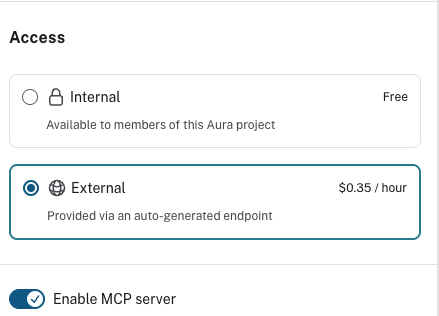
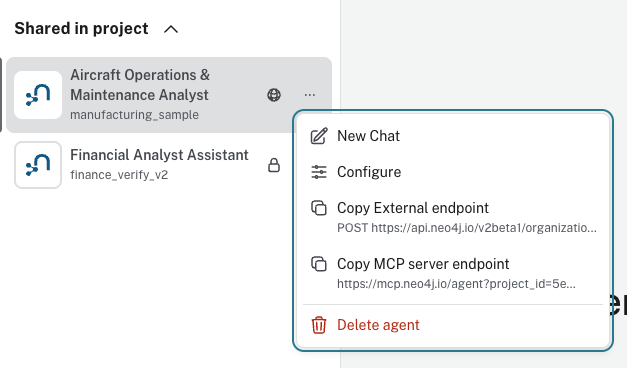

# Aura Agent MCP Server Setup

Connect the Neo4j Aura Agent you created in Lab 5 to any MCP-compatible client (Claude Code, Claude Desktop, VS Code, Cursor, etc.) as a remote MCP server. This gives your client direct access to all the agent tools (Cypher Templates, Similarity Search, Text2Cypher) configured on the Aura Agent.

## Prerequisites

- A deployed Neo4j Aura Agent from Lab 5
- An MCP-compatible client installed

## Step 1: Enable External Access and MCP Server

Open the Aura Console and navigate to **Agents**. Click the **...** menu on your agent and select **Configure**.

Under **Access**, select **External** ($0.35/hour) and toggle **Enable MCP server** on.



> **Note:** External access is billed at $0.35/hour while the agent is active. You can switch back to Internal when not in use.

## Step 2: Copy the MCP Server Endpoint URL

After enabling MCP, close the configuration panel. Click the **...** menu on your agent again and select **Copy MCP server endpoint**.



The URL will look like:

```
https://mcp.neo4j.io/agent?project_id=YOUR_PROJECT_ID&agent_id=YOUR_AGENT_ID
```

## Step 3: Get Your API Credentials

You need a client ID and client secret for programmatic authentication:

1. Click your **username** in the top-right corner of the Aura Console
2. Select **Account Settings**
3. Navigate to **API Keys**
4. Create a new API key or copy your existing client ID and client secret

Keep these credentials secure — you will use them in the next step.

## Step 4: Configure Your MCP Client

### Option A: Claude Code

Claude Code resolves `${VAR}` references in `.mcp.json` from your **shell environment** (it does not load `.env` files automatically).

1. Copy `.env.example` to a `.env` file and fill in your values:

```bash
cp Lab_5_Aura_Agents/.env.example Lab_5_Aura_Agents/.env
```

2. Export the MCP server URL before launching Claude Code:

```bash
export AURA_AGENT_MCP_SERVER="https://mcp.neo4j.io/agent?project_id=YOUR_PROJECT_ID&agent_id=YOUR_AGENT_ID"
```

To persist this, add the export to your shell profile (`~/.zshrc` or `~/.bashrc`), or source the `.env` file before starting Claude Code:

```bash
set -a && source Lab_5_Aura_Agents/.env && set +a
```

3. Copy `.mcp.json.template` to `.mcp.json` in your project root:

```bash
cp Lab_5_Aura_Agents/.mcp.json.template .mcp.json
```

4. Start claude
```
claude
```

This is project-scoped — it only applies when Claude Code is run from this repository.

4. The first time the MCP server is invoked, Claude Code will open a browser window for Aura OAuth authentication. Log in with the same credentials you use for the [Aura Console](https://console.neo4j.io).

To re-authenticate or check server status:

```
/mcp
```

### Option B: Other MCP Clients

Use the `.mcp.json.template` file as a reference for configuring other MCP clients (Claude Desktop, VS Code, Cursor, etc.). The key values you need are:

- **Server type:** `http`
- **URL:** Your MCP server endpoint from Step 2
- **Authentication:** OAuth via Aura Console credentials

## Step 5: Test It

Once connected, your MCP client has access to the Aura Agent's tools. Try these questions:

- "What systems does aircraft AC1001 have?"
- "Show maintenance events for aircraft AC1001"
- "What flights has aircraft AC1001 operated?"
- "What are the most common fault types across all maintenance events?"
- "Which airports have the most departing flights?"
- "Search for maintenance documentation about engine oil contamination"

The Aura Agent will select the appropriate tool (Cypher Template, Similarity Search, or Text2Cypher) automatically.

## Available Agent Tools

The "Create with AI" workflow generates tools based on your graph's schema, so the exact tools may vary. The following table shows a typical set of tools generated for the aircraft digital twin graph:


| Tool | Type | Description |
|------|------|-------------|
| Aircraft Systems and Components | Cypher Template | Systems and components connected to an aircraft by aircraft ID |
| Aircraft Maintenance Events | Cypher Template | Maintenance events for an aircraft by aircraft ID (faults, severity, corrective actions) |
| Aircraft Flights and Delays | Cypher Template | Flights operated by an aircraft and associated delays by aircraft ID |
| Search Maintenance Documentation | Similarity Search | Semantic vector search over maintenance manual chunks |
| Natural Language to Cypher Tool | Text2Cypher | Ad-hoc Cypher query generation from natural language |

## Optional: Add a Flight Lookup by Number Tool

The AI-generated Cypher Templates take an `aircraft_id` as input, so looking up a specific flight by its flight number (e.g., "EX370") relies on the Text2Cypher tool. If you want a deterministic Cypher Template for flight number lookup, you can add one manually:

1. In the Aura Console, open your agent and click **Add tool** → **Cypher Template**
2. Name it **Get Flight Details by Number**
3. Use this Cypher query:

```cypher
MATCH (f:Flight {flight_number: $flight_number})
OPTIONAL MATCH (f)<-[:OPERATES_FLIGHT]-(a:Aircraft)
OPTIONAL MATCH (f)-[:DEPARTS_FROM]->(origin:Airport)
OPTIONAL MATCH (f)-[:ARRIVES_AT]->(destination:Airport)
OPTIONAL MATCH (f)-[:HAS_DELAY]->(d:Delay)
RETURN f.flight_number AS flightNumber, a.aircraft_id AS aircraftId,
       f.operator AS operator, origin.iata AS origin, destination.iata AS destination,
       f.scheduled_departure AS scheduledDeparture, f.scheduled_arrival AS scheduledArrival,
       d.cause AS delayCause, d.minutes AS delayMinutes
```

4. Set the parameter `flight_number` with a description like "The flight number (e.g., EX370)"

With this tool added, the agent can handle questions like "Show details for flight EX370" deterministically.

## Troubleshooting

**MCP server not appearing:** Verify the env var is set in your shell (`echo $AURA_AGENT_MCP_SERVER`). Claude Code does not read `.env` files automatically.

**Authentication fails:** Run `/mcp` in Claude Code to check server status and re-authenticate. Ensure you can log in to [console.neo4j.io](https://console.neo4j.io).

**Agent not responding:** Check that the agent is set to **External** and not paused in the Aura Console. External agents are billed at $0.35/hour when active.
