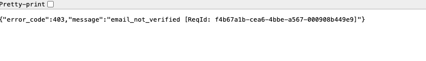
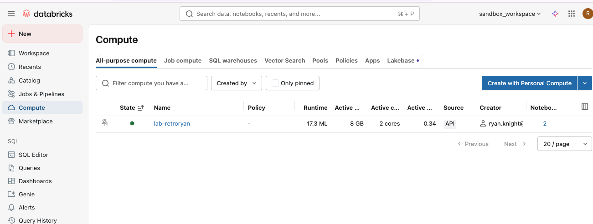
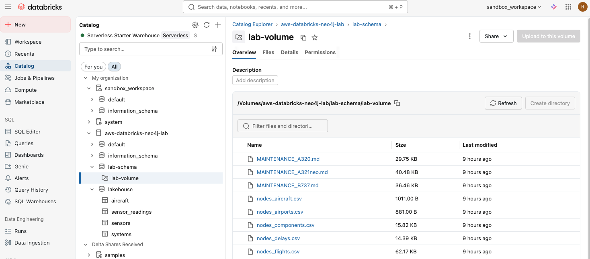
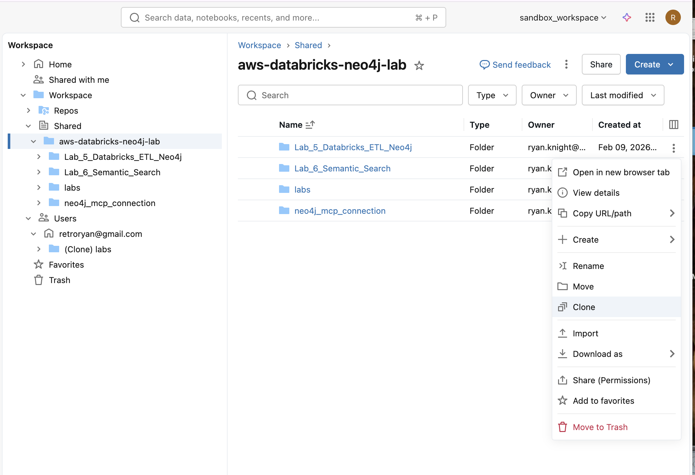
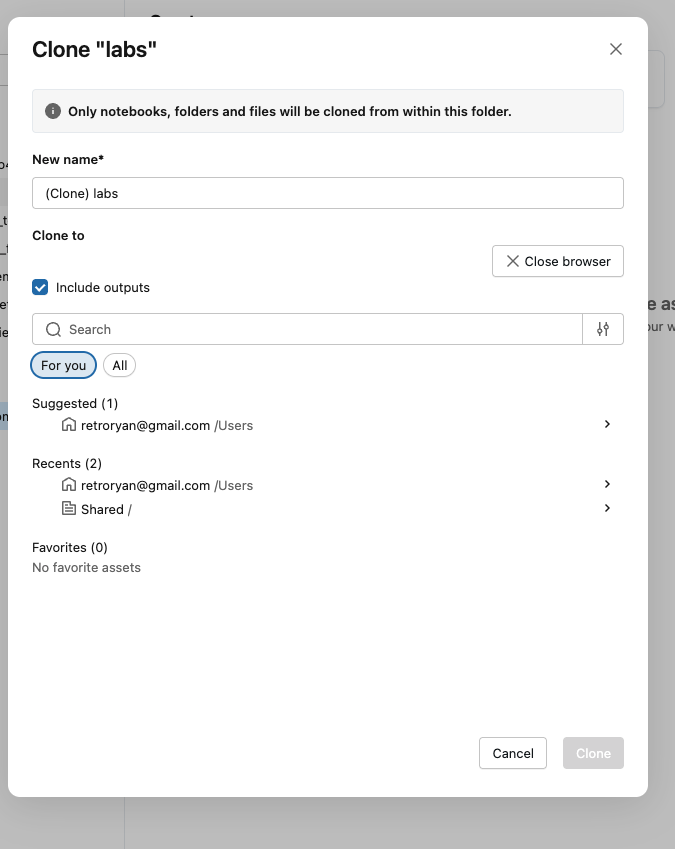
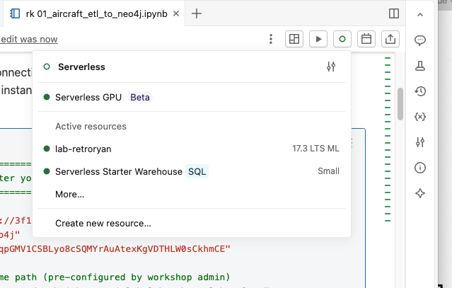

# Lab 5: Databricks ETL to Neo4j

Load aircraft data from Databricks into Neo4j using the Spark Connector.

> **Infrastructure:** This lab uses your **personal** Aura instance. You'll walk through the same ETL process used to build the shared Reference Aura Instance, loading data from shared CSV files into your own Neo4j database.

**Duration:** ~45 minutes

---

## Notebooks

This lab has two notebooks:

| Notebook | Description | Required For |
|----------|-------------|--------------|
| [`01_aircraft_etl_to_neo4j.ipynb`](01_aircraft_etl_to_neo4j.ipynb) | Core ETL — loads Aircraft, System, and Component nodes using the Spark Connector | Labs 6, 7 |
| [`02_load_neo4j_full.ipynb`](02_load_neo4j_full.ipynb) | Full dataset — adds Sensors, Airports, Flights, Delays, Maintenance Events, and Removals using the Spark Connector | **Lab 7** |

> **Important:** Run **both** notebooks before proceeding. Notebook 01 loads the core aircraft topology needed by all subsequent labs. Notebook 02 loads the complete dataset required by the Neo4j MCP agent in Lab 7 (AgentBricks).

---

## Prerequisites

Before starting this lab, ensure you have:

- [ ] Neo4j Aura credentials from Lab 1 (URI, username, password)
- [ ] Databricks workspace invitation email from your workshop admin

---

## Quick Start

1. **Accept** the workspace invitation from your email
2. **Verify** your personal compute cluster is running
3. **View** the CSV data files in the Unity Catalog Volume
4. **Clone** the lab notebooks into your home directory
5. **Attach** your compute cluster to the notebook
6. **Run notebook 01**: Enter your Neo4j credentials and **Run All** cells
7. **Run notebook 02**: Enter your Neo4j credentials and **Run All** cells
8. **Explore** the graph in Neo4j Aura

---

## Step-by-Step Instructions

### Step 1: Accept the Workspace Invitation

Your workshop admin has added you to a shared Databricks workspace. You received an email from Databricks inviting you to collaborate.

1. Click the link in the invitation email to open the Databricks sign-in page.
2. Select **Sign in with email**.
3. Databricks sends a one-time passcode (OTP) to your email address.
4. Check your inbox, copy the 6-digit code, and enter it on the sign-in page.

> **Tip:** The passcode expires after a few minutes. If it expires, click **Resend code** on the sign-in page to get a new one.

> **Note:** Sometimes after entering the passcode you may see an error like the one below. Simply refresh the page and you will be logged in.
>
> 


### Step 2: Verify Your Compute Cluster

In Databricks, **compute** refers to the cloud infrastructure that runs your code. A **compute cluster** is a set of virtual machines managed by Databricks that provides the CPU, memory, and Apache Spark runtime needed to execute notebook cells. Think of it as the engine behind your notebooks — without it, your code has nowhere to run.

Your workshop admin has pre-configured a personal cluster for each participant. Your cluster comes with:

- **Apache Spark** runtime for processing data at scale
- **Neo4j Spark Connector** library for writing DataFrames directly into Neo4j
- **Python packages** (`neo4j`, `neo4j-graphrag`, etc.) needed by the lab notebooks

To verify your cluster:

1. Click **Compute** in the left sidebar.
2. Look for a cluster named with your identifier (e.g., `lab-<yourname>`).
3. Confirm the cluster shows a green dot or **Running** status.

If the cluster is stopped, the workshop administrator will need to start it.



### Step 3: View the CSV Data

The CSV data for this lab has already been uploaded to a Unity Catalog Volume by your workshop admin. The notebooks you will run next will read and process this data to load it into Neo4j.

To view the data files:

1. Click **Catalog** in the left sidebar.
2. Navigate to **databricks-neo4j-lab > lab-schema > lab-volume**.
3. Browse the CSV files — you will see aircraft, airports, components, flights, delays, sensors, systems, and other data files that define the Aircraft Digital Twin dataset.



> **Note:** You do not need to modify or upload any data. The notebooks will read directly from this Volume path.

### Step 4: Clone the Lab Notebooks

A **notebook** in Databricks is an interactive document made up of cells that can contain Python code, SQL queries, or markdown text. You run cells one at a time or all at once, and each cell displays its output directly below it. Notebooks are the primary way you write and execute code in Databricks.

The lab notebooks are stored in a shared folder that all participants can see. You will clone (copy) them into your own workspace so you can edit and run them without affecting other participants.

1. Click **Workspace** in the left sidebar.
2. Expand **Shared > databricks-neo4j-lab**.
3. Click on the **Lab_5_Databricks_ETL_Neo4j** folder.
4. Right-click on the `Lab_5_Databricks_ETL_Neo4j` folder and select **Clone**.



The Clone dialog lets you place a personal copy of the notebooks in your home directory.

5. Update the **New name** to include your initials (e.g., `labs-rk`) so it is easy to identify.
6. Select the **For you** tab.
7. Choose your home directory as the destination.
8. Click **Clone**.



**Expected outcome:** A copy of the `labs` folder appears under your home directory in the Workspace browser. It contains all notebooks and the `data_utils.py` utility module.

### Step 5: Attach Your Compute Cluster

A notebook by itself is just a document — it needs to be **attached** to a compute cluster before any code can run. Attaching tells Databricks which cluster should execute the notebook's cells. By attaching your personal cluster, you get the pre-installed Neo4j Spark Connector and Python libraries that the lab requires.

1. Open the first notebook, `01_aircraft_etl_to_neo4j.ipynb`, from your cloned folder.
2. Click the **compute selector** in the top-right corner of the notebook (it may say "Serverless" or "Connect" by default).
3. Under **Active resources**, select your personal cluster (e.g., `lab-<yourname>`).

> **Note:** Do not use **Serverless** compute — it does not have the Neo4j Spark Connector installed.



**Expected outcome:** The notebook header shows your cluster name and a green connection indicator.

### Step 6: Configure and Run Notebook 01

1. Scroll to the **Configuration** cell near the top of the notebook.
2. Replace the placeholder values with your actual Neo4j Aura credentials:

   ```python
   NEO4J_URI = "neo4j+s://xxxxxxxx.databases.neo4j.io"
   NEO4J_USERNAME = "neo4j"
   NEO4J_PASSWORD = "<your-password>"
   ```

   > **Important:** The URI must start with `neo4j+s://` (the `+s` enables TLS encryption required by Aura).

3. Click **Run All** in the notebook toolbar (or press Shift+Enter through each cell).
4. Monitor the cell outputs as each step executes — you will see progress messages as Aircraft, System, and Component nodes are written to Neo4j.

### Step 7: Verify Results (Notebook 01)

The final verification cells display node and relationship counts. Confirm:

| Check | Expected Value |
|-------|----------------|
| Aircraft nodes | 20 |
| System nodes | 80 |
| Component nodes | 320 |
| HAS_SYSTEM relationships | 80 |
| HAS_COMPONENT relationships | 320 |

**Expected outcome:** The notebook completes without errors and the verification cells show 20 Aircraft nodes, 80 System nodes, and 320 Component nodes in Neo4j.

### Step 8: Run the Full Dataset (Notebook 02)

Open `02_load_neo4j_full` from your cloned folder and run the complete dataset load:

1. Attach your compute cluster (same as Step 5)
2. Enter your Neo4j credentials (same as notebook 01)
3. Set `CLEAR_DATABASE = True` for a clean load (recommended)
4. Click **Run All**

This loads additional node types and relationships required by Lab 7:

| Node Type | Count | Description |
|-----------|-------|-------------|
| Sensor | 160 | Monitoring equipment (EGT, Vibration, N1Speed, FuelFlow) |
| Airport | 12 | Route network locations |
| Flight | ~800 | Flight operations |
| Delay | ~300 | Delay causes and durations |
| MaintenanceEvent | ~300 | Fault tracking with severity |
| Removal | ~60 | Component removal history |

### Step 9: Explore in Neo4j Aura

1. Open [console.neo4j.io](https://console.neo4j.io) in a new browser tab
2. Sign in and select your instance
3. Click **Query** to open the query interface
4. Copy and paste queries from the [Sample Queries](SAMPLE_QUERIES.md) page to explore your graph

---

## What You Loaded

### Notebook 01: Core Graph Structure

```
(Aircraft) -[:HAS_SYSTEM]-> (System) -[:HAS_COMPONENT]-> (Component)
```

| Entity | Count | Description |
|--------|-------|-------------|
| Aircraft | 20 | Boeing 737-800, Airbus A320/A321, Embraer E190 |
| System | 80 | 2 engines + avionics + hydraulics per aircraft |
| Component | 320 | Fans, compressors, turbines, pumps, etc. |

### Notebook 02: Full Dataset (adds to above)

```
(Aircraft) -[:HAS_SYSTEM]-> (System) -[:HAS_SENSOR]-> (Sensor)
(Aircraft) -[:OPERATES_FLIGHT]-> (Flight) -[:DEPARTS_FROM / :ARRIVES_AT]-> (Airport)
(Flight) -[:HAS_DELAY]-> (Delay)
(Component) -[:HAS_EVENT]-> (MaintenanceEvent) -[:AFFECTS_SYSTEM / :AFFECTS_AIRCRAFT]-> ...
(Aircraft) -[:HAS_REMOVAL]-> (Removal) -[:REMOVED_COMPONENT]-> (Component)
```

| Entity | Count | Description |
|--------|-------|-------------|
| Sensor | 160 | EGT, Vibration, N1Speed, FuelFlow per engine |
| Airport | 12 | Route network |
| Flight | ~800 | Flight operations |
| Delay | ~300 | Delay causes |
| MaintenanceEvent | ~300 | Fault tracking |
| Removal | ~60 | Component removals |

### Sample Aircraft

| Tail Number | Model | Manufacturer | Operator |
|-------------|-------|--------------|----------|
| N95040A | B737-800 | Boeing | ExampleAir |
| N30268B | A320-200 | Airbus | SkyWays |
| N54980C | A321neo | Airbus | RegionalCo |
| N37272D | E190 | Embraer | NorthernJet |

---

## Troubleshooting

### "Connection refused" or timeout errors

- Verify your Neo4j URI starts with `neo4j+s://` (note the `+s`)
- Check your Neo4j Aura instance is running (green status in console)
- Confirm username and password are correct (no extra spaces)

### "Spark Connector not found" error

- Ensure you're using the workshop cluster (not a personal cluster)
- The cluster must be in **Dedicated (Single User)** access mode
- Try restarting the cluster

### "Path does not exist" for data files

- Verify the DATA_PATH matches your workshop configuration
- Ask your instructor for the correct Volume path

### Duplicate nodes appearing

- The notebook uses Overwrite mode, so re-running should replace data
- If needed, clear your Neo4j database first:
  ```cypher
  MATCH (n) DETACH DELETE n
  ```

### Notebook cells failing

- Run cells in order from top to bottom
- Don't skip the configuration cells
- Check the error message for specific issues

---

## Key Concepts Learned

1. **Unity Catalog Volumes** store files accessible from notebooks
2. **Neo4j Spark Connector** writes DataFrames directly to Neo4j
3. **Node loading** uses `labels` and `node.keys` options
4. **Relationship loading** uses `keys` strategy to match existing nodes
5. **Cypher queries** can be run from Databricks to verify data

---

## Next Steps

After completing this lab:
- Continue to [Lab 6 - Semantic Search](../Lab_6_Semantic_Search) to add GraphRAG capabilities over maintenance documentation
- Continue to [Lab 7 - AgentBricks](../Lab_7_AgentBricks) to build multi-agent systems with Genie and Neo4j MCP
- The data you loaded will be queried by AI agents in later labs

---

## Help

- Ask your instructor for assistance
- Check the [Neo4j Spark Connector docs](https://neo4j.com/docs/spark/current/)
- Review the [Cypher Query Language reference](https://neo4j.com/docs/cypher-manual/current/)
