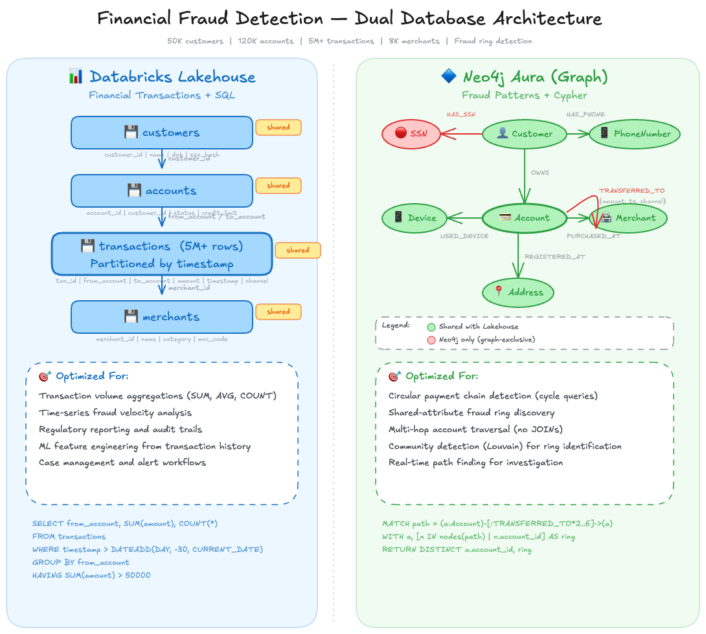

<style>
section {
  --marp-auto-scaling-code: false;
}

li {
  opacity: 1 !important;
  animation: none !important;
  visibility: visible !important;
}

/* Disable all fragment animations */
.marp-fragment {
  opacity: 1 !important;
  visibility: visible !important;
}

ul > li,
ol > li {
  opacity: 1 !important;
}
</style>

# Databricks + Neo4j

Data Intelligence Meets Graph Intelligence

---

## Data Intelligence Meets Graph Intelligence

- **Databricks (Data Intelligence Platform):** structured, semi-structured, unstructured data at scale
- **Neo4j (Graph Intelligence Platform):** connections between entities, explicit and traversable

<!--
Databricks is the Data Intelligence Platform. It governs and analyzes
structured, semi-structured, and unstructured data at scale.

Neo4j is the Graph Intelligence Platform. It makes connections between
entities explicit and traversable.

This slide sets up the framing for the rest of the deck. The next two
slides break down what each platform actually does.
-->

---

## Databricks: The Data Intelligence Platform

- **Aggregates** transactions, sensor streams, clickstreams
- **Governs** documents, images, unstructured files
- **Databricks SQL** at petabyte scale, real-time streaming, data science
- **Mosaic AI** (agent systems), **AI/BI Genie** (conversational analytics), **Agent Bricks** (agent control plane)

<!--
Databricks handles structured, semi-structured, and unstructured data.
It aggregates transactions and sensor streams, governs documents and
images through Unity Catalog, runs SQL against Delta Lake at petabyte
scale, and supports ML pipelines from feature engineering through
model serving. Schema enforcement, ACID transactions, and time travel
provide the foundation.
-->

---

## Neo4j: The Graph Intelligence Platform

- **Traverses** supply chains, fraud networks, knowledge graphs
- **Cypher** pattern matching on nodes and relationships
- **Multi-hop traversal** and path finding in milliseconds
- **Graph Data Science** (graph algorithms), **AuraDB** (managed database), **GraphRAG** (graph-enhanced retrieval)

<!--
Neo4j makes connections between entities explicit and traversable.
Cypher is the query language for graph databases, operating over nodes
and relationships. Multi-hop traversals that would require complex
recursive SQL run in milliseconds. Pattern matching across connection
topologies reveals structures invisible in flat tables.
-->

---

## Neo4j Graph Components

- Graphs model the real world as **nodes** (entities) and **relationships** (connections)
- `(parentheses)` are nodes, `[:brackets]` are relationships

```
(:Account)-[:TRANSFERRED_TO {amount, timestamp, channel}]->(:Account)
```

Each Account node carries properties (account_id, customer_name, status). Each TRANSFERRED_TO relationship carries transaction details (amount, timestamp, channel).

---

## Different Data, Different Query Patterns

Most problems need **both**

| Question | Platform |
|---|---|
| Total transfer volume by account | Databricks (SQL aggregation) |
| Accounts within three hops of a flagged account | Neo4j (graph traversal) |
| Find the fraud ring, compute its total volume | Both |

<!--
This is the payoff slide for the framing. Each question maps to the
platform built to answer it. The third row shows why you need both:
Neo4j detects the fraud ring through cycle traversal, Databricks
computes transfer totals for the identified accounts. Neither platform
can answer that question alone.
-->

---

## Mapping the Lakehouse to the Graph

- **Most data stays in the lakehouse:** tables, files, documents, governed by Unity Catalog
- **Connection data** maps to the graph: transfers between accounts, shared addresses, component hierarchies
- **Foreign keys become relationships:** implicit joins become explicit, traversable edges

---

## Tables Become Graphs

Data in Databricks lives in **rows and columns**. Data in Neo4j lives as **nodes and relationships**.

| Lakehouse (Databricks) | Knowledge Graph (Neo4j) |
|------------------------|------------------------|
| A row in an Accounts table | An Account node |
| Columns like account_id, customer_name, status | Properties on that node |
| A foreign key linking two accounts in a transaction | A `TRANSFERRED_TO` relationship |
| A JOIN across tables | A graph traversal |

What was implicit in table joins becomes **explicit and traversable** in the graph.

---

# A Working Example

---

## Financial Fraud as a Working Example

- **Money laundering hides in plain sight:** circular transfers across account chains
- **Each transfer looks legitimate.** The cycle reveals the fraud
- **Cypher:** one query detects 2-6 hop cycles in milliseconds
- **SQL equivalent:** nested SQL joins (CTEs) with cycle-detection guards

<!--
Funds move through chains of accounts and return to the origin.
Each individual transfer looks legitimate in isolation. The circular
pattern is only visible when you follow the connections. Detecting
a cycle of 2-6 hops is a single Cypher query returning in
milliseconds. The equivalent SQL requires recursive CTEs with
explicit cycle-detection guards to prevent infinite loops. This is
a small enough model to explain in minutes, but complex enough to
reveal patterns invisible in flat tables.
-->

---

## Fraud Ring — Dual Database Architecture



---

# Building the Pipeline

From data intelligence through graph intelligence to agents that query both

---

## Three Pipeline Stages

- **ETL/Curation:** data intelligence, curated lakehouse tables become graph nodes and relationships
- **GraphRAG Enrichment:** graph intelligence, AML policy docs become embedded, entity-linked knowledge
- **Querying/Agent:** both, investigation agents query the graph and the lakehouse together

<!--
Three distinct stages connect Databricks to Neo4j. ETL runs on
classic compute using the Spark Connector to batch-load curated
lakehouse tables as graph nodes and relationships. GraphRAG
enrichment uses the Python driver to chunk regulatory and AML
policy documents, generate embeddings, and extract entities back
into the graph. The agent layer is fully serverless, using
neo4j-graphrag-python for knowledge retrieval and
neo4j-agent-memory for conversational state across investigation
sessions.
-->

---

## Extracting Connection Data from the Lakehouse

- **Delta Lake** remains the source of truth: schema enforcement, ACID transactions, time travel, access controls
- **Neo4j** receives the connected data: only the subset with relationship patterns worth traversing projects from the lakehouse into the graph
- **The pipeline** has two phases: get clean data into governed Delta tables, then project the connections into the graph

---

## From Raw Data to Governed Delta Tables

- **Unity Catalog Volumes** provide the governed landing zone: access controls and audit logging from day one
- **Delta Lake** catches bad data at the source: malformed account IDs and invalid amounts fail here, not during the graph load
- **Column renaming** happens at this stage: `Customer_ID` becomes `account_id`, `Txn_Amount` becomes `amount`, so graph properties are clean without extra transformation
- **Time travel** enables recovery from bad loads; **incremental processing** loads only modified rows

---

## The Neo4j Spark Connector

- **Officially supported bridge** between Databricks and Neo4j
- **Databricks → Neo4j:** Turn Lakehouse rows into graph nodes and relationships
- **Neo4j → Databricks:** Pull graph data back into DataFrames for analytics or ML
- **Supports batch and incremental** loading patterns

---

## Loading the Graph

- **Nodes first:** each row in the accounts Delta table becomes an Account node, with batched upserts that create if new or update if existing
- **Relationships second:** the connector matches existing Account nodes by property values and creates `TRANSFERRED_TO` connections between them
- **Transaction properties ride on the relationship:** amount, timestamp, and channel are stored directly on the `TRANSFERRED_TO` relationship — no separate edge table

---

## Validation Through Spark Reads

- The connector reads from Neo4j just as easily as it writes — Cypher results come back as **standard DataFrames**
- Validation runs in the **same Spark environment** that built the graph

**Three checks cover the common failure modes:**

- **Total node counts** should match source row counts
- **Relationship counts** should fall within expected ranges for the transaction volume
- **High-connectivity nodes** should reflect known characteristics from the source data (e.g., high-volume accounts with expected transfer counts)

---

## Bidirectional Flow Through the Medallion Architecture

The **Medallion Architecture** progressively refines raw data into business-ready outputs. The bidirectional flow is where data intelligence and graph intelligence **compound each other's value**.

| Layer | Contains | Role |
|-------|----------|------|
| **Bronze** | Raw transaction and account data as-is | Landing zone |
| **Silver** | Cleaned accounts and transactions with proper types and graph-friendly column names | Ready for Neo4j ingestion |
| **Gold** | Graph algorithm results (cycle detection, community scores, centrality) written back to Delta, plus fraud alerts and case management data | Business-ready outputs enriched by graph insights |

---

## Graph Insights Flow Back to the Lakehouse

Graph intelligence flows back as standard DataFrames. Graph-derived metrics become columns in Delta tables — available for dashboards, ML features, and downstream analytics across the entire data intelligence estate.

| Graph Algorithm | What It Produces | What It Becomes in Delta Lake |
|----------------|-----------------|-------------------------------|
| **Cycle Detection** | Accounts involved in circular transaction chains | A flag in the fraud alerts table |
| **PageRank** | Influential accounts based on transaction flow patterns | A risk-scoring column for investigation prioritization |
| **Louvain Community Detection** | Clusters of tightly connected accounts | A grouping dimension for fraud ring identification |
| **Degree Centrality** | How many counterparties an account transacts with | A feature in fraud-prediction ML models |

Once in Delta Lake, these insights are available for **fraud case management**, as **features in ML models**, or joined with operational data like account histories that never left the lakehouse.

---

## Other Ways to Connect Neo4j from Databricks

The Spark Connector is optimized for batch reads and writes. But it's one of several connection patterns available from Databricks.

| Pattern | Best For | How It Works |
|---------|----------|-------------|
| **Spark Connector** | Batch ELT pipelines | DataFrame reads/writes through Spark's data source API |
| **Unity Catalog JDBC** | Governed SQL access, cross-system joins | SQL-to-Cypher translation via the Neo4j JDBC driver |
| **MCP Server** | Agent-driven, schema-aware querying | Exposes schema inspection and read-only Cypher as agent tools |

The choice depends on the query shape and the consumer.

---

## What the Dual Architecture Enables

The pattern scales from simple connections to self-reinforcing networks.

| Use Case | Data Intelligence (Databricks) | Graph Intelligence (Neo4j) |
|----------|------------------------|-------------------|
| **Fraud detection** | Governs transaction records, case management, regulatory reporting | Cycle detection in payment chains, community detection across shared attributes |
| **Customer 360** | Purchase histories, CRM records, segmentation, lifetime value | Interaction graph — "who is connected to whom through shared touchpoints?" |
| **GraphRAG** | Stores documentation with full-text search and versioning, generates embeddings | Adds semantic relationships so traversal finds related content through structural connections, not just vector similarity |

GraphRAG is explored in depth in the next section of this series.

---

## Summary

**Databricks + Neo4j** is a natural pairing:

- **Delta Lake governs the data.** Schema enforcement, ACID transactions, and time travel provide the source of truth.
- **Neo4j reveals the connections.** Relationship queries, graph algorithms, and path finding run against the connection topology.
- **The Spark Connector bridges both directions.** Lakehouse data becomes a graph, and graph insights flow back to Delta tables.
- **The Medallion Architecture governs the journey.** Bronze lands raw data, Silver cleans it for the graph, Gold captures graph insights written back to Delta.

Together, data intelligence and graph intelligence compound each other — connected through governed pipelines, not siloed in separate platforms.

---

## Appendix: Implementation Details

---

## Design Decision: Relationship Types vs. Properties

The fraud example uses a single **relationship type** (`TRANSFERRED_TO`) with transaction details as properties. In other domains you may face the choice between multiple relationship types or a generic type with a property.

| Approach | Example | Tradeoff |
|----------|---------|----------|
| **Type per connection** | `:TRANSFERRED_TO`, `:SHARED_DEVICE` | Relationship type lookups are indexed and faster; larger type vocabulary |
| **Generic with property** | `:CONNECTED {type: "transfer"}` | Simpler schema; property filters are slower than type lookups |

Choose **type per connection** when traversals need to follow specific connection types. Neo4j relationships are directional, so bidirectional flows require writing in **both directions**.

---

## Debugging: When Relationships Fail to Create

If relationships fail to create, the MATCH clauses aren't finding nodes. Two common causes:

1. **The node load failed** and the target Account doesn't exist
2. **Key values don't match** between the DataFrame column and the node property

The connector doesn't surface which case applies. If a match fails because no Account node has an `account_id` matching the DataFrame value, that relationship row **silently drops**.

**Checking manually is required.** Compare the node properties in Neo4j against the relationship DataFrame values to identify mismatches.

---

## Appendix: Graph vs. SQL Decision Framework

---

## When to Query the Graph vs. Stay in the Lakehouse

**Stay in SQL / Databricks when:**

- The question is about aggregation: totals, averages, counts, distributions
- The data fits naturally in rows and columns with no recursive joins
- You need full-table scans over billions of records (Spark's distributed engine is built for this)
- The answer lives in a single table or a small number of predictable joins

**Move to Cypher / Neo4j when:**

- The question involves connections between entities — "who is connected to whom?"
- You need variable-length traversal — following chains where the depth isn't known in advance
- The join count would be three or more self-joins against the same table
- You need real-time path finding or pattern matching against a connection topology
- The query shape changes based on what you find (exploratory traversal)

**The rule of thumb:** if you're counting things, stay in SQL. If you're following connections, move to the graph.

---

## Decision Table: SQL vs. Cypher

| Signal | Stay in SQL | Move to Cypher |
|--------|-------------|----------------|
| Number of hops | 1–2 fixed joins | 3+ or variable depth |
| Query shape | Known at design time | Depends on the data encountered |
| Result type | Aggregated numbers | Paths, subgraphs, connected components |
| Latency requirement | Batch is fine | Sub-second for interactive investigation |
| Data volume per query | Millions of rows scanned | Thousands of entities traversed |

---

## Appendix: Cypher vs. SQL Side-by-Side

---

## The Same Question, Two Languages

**Question:** Find all accounts within three hops of a known fraudulent account (account-1234) through shared devices or addresses.

**SQL (Databricks):**

```sql
WITH hop1 AS (
    SELECT DISTINCT ad2.account_id
    FROM account_devices ad1
    JOIN account_devices ad2
      ON ad1.device_id = ad2.device_id AND ad1.account_id != ad2.account_id
    WHERE ad1.account_id = 'account-1234'
    UNION
    SELECT DISTINCT aa2.account_id
    FROM account_addresses aa1
    JOIN account_addresses aa2
      ON aa1.address_id = aa2.address_id AND aa1.account_id != aa2.account_id
    WHERE aa1.account_id = 'account-1234'
),
hop2 AS (
    SELECT DISTINCT ad2.account_id
    FROM hop1 h JOIN account_devices ad1 ON h.account_id = ad1.account_id
    JOIN account_devices ad2
      ON ad1.device_id = ad2.device_id AND ad1.account_id != ad2.account_id
    UNION
    SELECT DISTINCT aa2.account_id
    FROM hop1 h JOIN account_addresses aa1 ON h.account_id = aa1.account_id
    JOIN account_addresses aa2
      ON aa1.address_id = aa2.address_id AND aa1.account_id != aa2.account_id
),
hop3 AS (
    SELECT DISTINCT ad2.account_id
    FROM hop2 h JOIN account_devices ad1 ON h.account_id = ad1.account_id
    JOIN account_devices ad2
      ON ad1.device_id = ad2.device_id AND ad1.account_id != ad2.account_id
    UNION
    SELECT DISTINCT aa2.account_id
    FROM hop2 h JOIN account_addresses aa1 ON h.account_id = aa1.account_id
    JOIN account_addresses aa2
      ON aa1.address_id = aa2.address_id AND aa1.account_id != aa2.account_id
)
SELECT account_id FROM hop1 UNION
SELECT account_id FROM hop2 UNION
SELECT account_id FROM hop3;
```

---

## The Same Question in Cypher

**Cypher (Neo4j):**

```cypher
MATCH (flagged:Account {account_id: 'account-1234'})
      -[:USED_DEVICE|REGISTERED_AT*1..3]-
      (connected:Account)
WHERE connected <> flagged
RETURN DISTINCT connected.account_id
```

The SQL version requires manually coding each hop as a separate CTE with explicit joins across two link tables. Adding a fourth hop means another CTE block. The Cypher version expresses the same traversal in three lines, and changing `*1..3` to `*1..5` extends the search with no structural change.

---

## Appendix: Schema Shift — Fraud Edition

---

## From Transaction Tables to a Fraud Graph

In the lakehouse, fraud data lives across several tables:

| Delta Table | Columns |
|-------------|---------|
| `accounts` | account_id, customer_name, ssn, opened_date, status |
| `transactions` | txn_id, from_account, to_account, amount, timestamp, channel |
| `devices` | device_id, fingerprint, ip_address |
| `account_devices` | account_id, device_id, first_seen, last_seen |
| `addresses` | address_id, street, city, state, zip |
| `account_addresses` | account_id, address_id, address_type |

In the graph, these become:

```
(:Account {account_id, customer_name, opened_date, status})
(:Device {device_id, fingerprint, ip_address})
(:Address {street, city, state, zip})
(:SSN {value})

(account)-[:TRANSFERRED_TO {amount, timestamp, channel}]->(account)
(account)-[:USED_DEVICE {first_seen, last_seen}]->(device)
(account)-[:REGISTERED_AT {address_type}]->(address)
(account)-[:HAS_SSN]->(ssn)
```

---

## Modeling Decisions That Matter

- **Shared attributes become nodes, not properties** — SSN as a column hides shared identities; SSN as a node makes the connection explicit without a self-join
- **Transactions become relationships with properties** — amount, timestamp, and channel ride on `TRANSFERRED_TO` directly, no foreign key resolution at query time
- **Temporal properties stay on relationships** — timestamps on `USED_DEVICE` and `TRANSFERRED_TO` enable time-windowed queries without a separate time-dimension table
- **Only connection-relevant data enters the graph** — columns like `marketing_opt_in` stay in Delta Lake; columns like `status` and `opened_date` stay on nodes because they filter fraud queries

---

## Appendix: Other Fraud Patterns the Graph Enables

---

## Synthetic Identity Fraud

- Fraudsters combine a real SSN with a fake name and address to fabricate identities
- Multiple synthetic identities share fragments — same SSN, device fingerprint, or mailing address — creating a hidden network
- In the graph, every shared attribute is an explicit connection; community detection surfaces clusters without predefined queries

```cypher
MATCH (a1:Account)-[:HAS_SSN|USED_DEVICE|REGISTERED_AT]->(shared)
      <-[:HAS_SSN|USED_DEVICE|REGISTERED_AT]-(a2:Account)
WHERE a1 <> a2
WITH a1, a2, COUNT(DISTINCT shared) AS shared_identifiers
WHERE shared_identifiers >= 2
RETURN a1.account_id, a2.account_id, shared_identifiers
ORDER BY shared_identifiers DESC
```

---

## First-Party Fraud Rings

- A coordinated group opens accounts, builds credit history, maxes out credit lines simultaneously, and disappears
- Each individual account looks legitimate in isolation — the ring is only visible through shared connections
- Community detection algorithms (Louvain, Label Propagation) identify tightly connected clusters in the shared-attribute graph

**Operational flow:** Ingest in Delta (Bronze/Silver) → Load to Neo4j via Spark Connector → Run community detection → Write community assignments back to Gold tables for case management

---

## Bust-Out Fraud

- A fraudster opens an account, makes small purchases and on-time payments for months, then rapidly maxes out and vanishes
- The behavioral shift is visible as a change in transaction velocity and amounts over time
- Combined with shared-attribute connections, the graph reveals **coordinated** bust-outs across multiple accounts

```cypher
MATCH (a:Account)-[recent:PURCHASED]->(m:Merchant)
WHERE recent.timestamp > datetime() - duration('P30D')
WITH a, COUNT(recent) AS txn_30d, SUM(recent.amount) AS spend_30d
MATCH (a)-[hist:PURCHASED]->(m:Merchant)
WHERE hist.timestamp > datetime() - duration('P180D')
  AND hist.timestamp <= datetime() - duration('P30D')
WITH a, txn_30d, spend_30d,
     COUNT(hist) AS txn_prior, SUM(hist.amount) AS spend_prior
WHERE spend_30d > spend_prior * 2
RETURN a.account_id, spend_30d, spend_prior
ORDER BY spend_30d DESC
```
