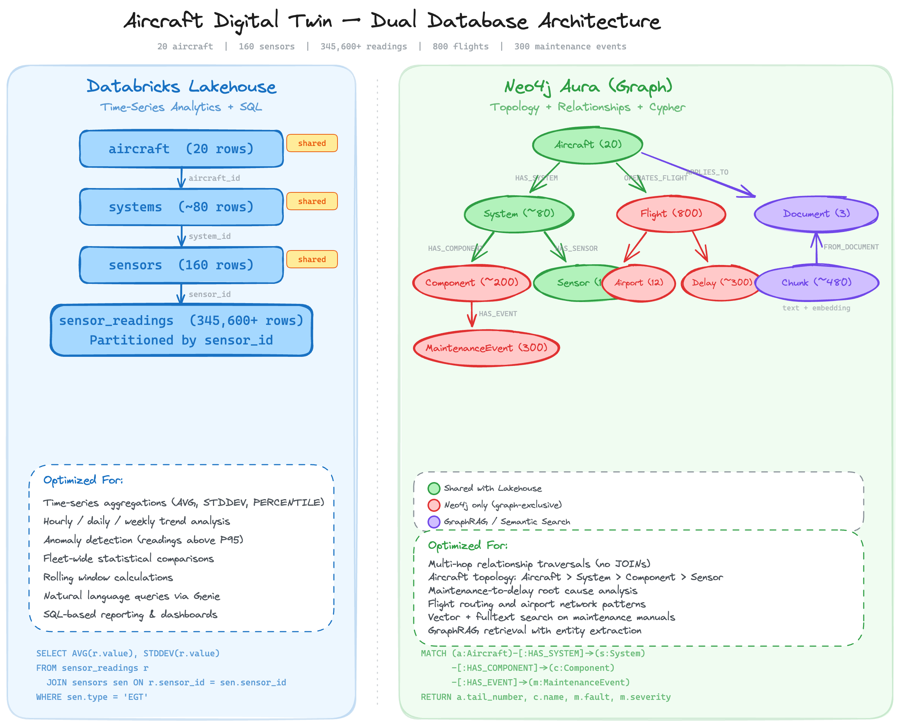
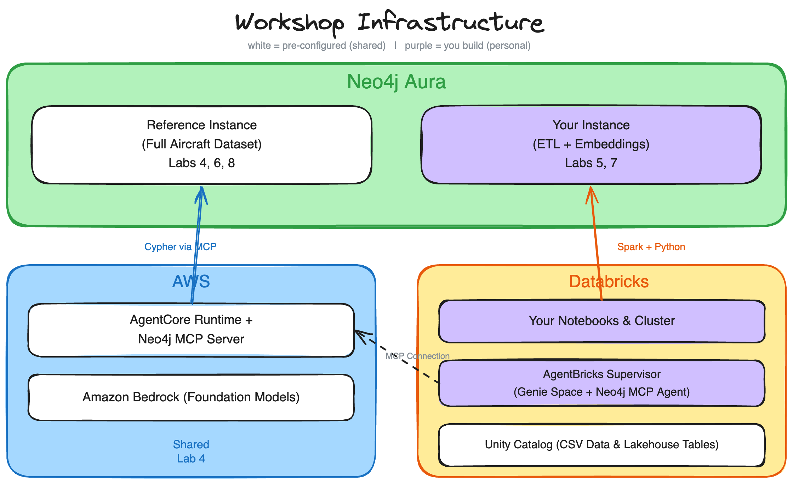

# Workshop Overview & GenAI Foundations

A participant reference covering the workshop overview, GenAI capabilities and limitations, traditional RAG, and the case for GraphRAG.

---

## Workshop Overview

### What You'll Build

- **Load** aircraft fleet data into a Neo4j knowledge graph using the Spark Connector and Python driver
- **Explore** a pre-deployed AWS AgentCore agent that queries Neo4j via MCP
- **Build** a multi-agent supervisor combining Databricks Genie (sensor analytics) with Neo4j MCP (graph queries)
- **Add** semantic search with vector embeddings and GraphRAG retrievers
- **Create** a no-code Aura Agent with Cypher Templates, Text2Cypher, and Similarity Search

### What Is a Digital Twin?

A **digital twin** is a virtual representation of a physical system — its structure, state, and behavior modeled in data.

For an aircraft fleet this means capturing:

- **Topology**: Aircraft, systems, components, and sensors and how they connect
- **Operations**: Flights, routes, delays
- **Maintenance**: Events, faults, component removals, corrective actions
- **Documentation**: Maintenance manuals, procedures, operating limits

### Why Knowledge Graphs for Digital Twins?

Digital twins are fundamentally about **relationships** — a component belongs to a system, a system belongs to an aircraft, a fault affects a component, a removal follows a maintenance event.

Knowledge graphs model this naturally:

- Entities become **nodes** with properties
- Connections become **relationships** with types and properties
- Multi-hop traversals are native — no expensive JOINs
- The graph *is* the twin — query it, reason over it, extend it

Tabular databases can store the same data, but answering "Which components caused flight delays?" requires chaining multiple JOINs across many tables. In a graph, it's a single traversal.

### The Aircraft Digital Twin Dataset

The workshop uses a comprehensive dataset modeling a complete aviation fleet over 90 operational days:

| Entity | Count | Description |
|--------|-------|-------------|
| Aircraft | 20 | Tail numbers, models, operators |
| Systems | 80 | Engines, Avionics, Hydraulics per aircraft |
| Components | 320 | Turbines, Compressors, Pumps |
| Sensors | 160 | Monitoring metadata |
| Sensor Readings | 345,600+ | Hourly telemetry over 90 days |
| Flights | 800 | Departure/arrival information |
| Maintenance Events | 300 | Fault severity and corrective actions |
| Airports | 12 | Route network |

### Dual Database Architecture

The data is split across two platforms, each chosen for the workload it handles best:

**Databricks Lakehouse** — Time-series sensor telemetry
- 345,600+ hourly readings across 90 days
- Columnar storage and SQL for aggregations, trend analysis, statistical comparisons

**Neo4j Aura** — Richly connected relational data
- Aircraft topology, component hierarchies, maintenance events, flights, delays, airport routes
- Native multi-hop traversals without expensive JOINs

A multi-agent supervisor routes questions to the right database automatically.



### Workshop Infrastructure

**Shared resources** (pre-configured by administrators):

| Resource | Description |
|----------|-------------|
| Reference Aura Instance | Fully populated Neo4j database with the complete Aircraft Digital Twin |
| Neo4j MCP Server | Deployed to AWS AgentCore, connected to the Reference Aura Instance |
| AgentCore Sample Agent | Pre-deployed agent that calls Neo4j MCP for natural language graph queries |
| Databricks Data & Tables | CSV files in Unity Catalog Volume and pre-created Lakehouse tables |
| Databricks MCP Connection | External MCP server registered in Unity Catalog |

**Personal resources** (per participant):

| Resource | Description |
|----------|-------------|
| Personal Aura Instance | Your own Neo4j database to load data into during ETL labs |
| Databricks Workspace | Clone notebooks and run them on a shared cluster |

Labs using the MCP server (AgentCore, AgentBricks) connect to the shared Reference Aura Instance. Labs doing ETL and GraphRAG (Labs 5, 7) load data into your personal instance.



---

## The GenAI Promise and Its Limits

### What Generative AI Does Well

LLMs excel at tasks that rely on pattern recognition and language fluency:

- **Text generation**: Creating human-like responses, summaries, explanations
- **Language understanding**: Parsing intent, extracting meaning, following instructions
- **Pattern completion**: Continuing sequences, filling in blanks, generating variations
- **Translation and transformation**: Converting between formats, styles, languages


### The Three Core Limitations

#### 1. Hallucination: Confident But Wrong

LLMs generate responses based on statistical likelihood, not factual verification.

- Produces the most *probable* continuation, not the most *accurate*
- Doesn't say "I don't know" — generates plausible-sounding text instead
- Complete with fabricated details and citations

**Real Example:** In 2023, US lawyers were sanctioned for submitting an LLM-generated brief with six fictitious case citations.

#### 2. Knowledge Cutoff: No Access to Your Data

LLMs are trained at a specific point in time on publicly available data. They don't know:

- Recent events after their training cutoff
- Your company's documents, databases, or internal knowledge
- Real-time data: current prices, live statistics, changing conditions

#### 3. Relationship Blindness: Can't Connect the Dots

LLMs process text sequentially and treat each piece in isolation. Questions they struggle with:

- "Which aircraft have engines with critical maintenance events?"
- "What components share the same fault types across the fleet?"
- "How is a sensor reading connected to a flight delay?"

These questions require *reasoning over relationships* — connecting entities across documents and traversing chains of connections.

### Why These Limitations Matter

| Limitation | Impact | Example |
|------------|--------|---------|
| Hallucination | Can't trust answers without verification | Legal brief with fabricated citations |
| Knowledge cutoff | Can't answer questions about your data | "What maintenance was done on AC1001 last month?" |
| Relationship blindness | Can't reason across connected information | "Which aircraft have engines with critical faults?" |

### The Solution: Providing Context

All three limitations have a common solution — **providing context**.

When you give an LLM relevant information in its prompt:

- It has facts to work with (reduces hallucination)
- It can access your specific data (overcomes knowledge cutoff)
- You can structure that information to show relationships (enables reasoning)

This is the foundation of **Retrieval-Augmented Generation (RAG)**.

---

## Traditional RAG: Chunking and Vector Search


### How Traditional RAG Works

Traditional RAG follows a simple pattern:

1. **Index documents**: Break documents into chunks and create embeddings
2. **Receive query**: User asks a question
3. **Retrieve context**: Find chunks with embeddings similar to the query
4. **Generate response**: Pass retrieved chunks to LLM as context

### Embeddings: The Smart Librarian Analogy

Think of embeddings like having a **really smart librarian** who has read every book in the library.

**Traditional catalog (keywords):**
- Books organized by title, author, subject
- Search for "dogs" only finds books with "dogs" in the title/subject
- Miss books about "canines," "puppies," or "pets"

**Smart librarian (embeddings):**
- Understands what each book is *about*
- "I want something about loyal companions" finds dog books, even without the word "dog"
- Organizes by meaning, not just labels


### The RAG Retrieval Flow

```
User Question
     |
Create embedding of question
     |
Compare to all chunk embeddings
     |
Return top K most similar chunks
     |
Send chunks + question to LLM
     |
LLM generates answer using chunks as context
```

### What Traditional RAG Enables

Works well for:

- "What does this document say about X?"
- Finding relevant passages by topic
- Answering questions within a single document

Traditional RAG is the foundation of modern AI assistants, but it has important limitations when dealing with connected information.

---

## The Limits of Traditional RAG

### RAG Helps, But Introduces New Challenges

Traditional RAG provides context to LLMs — it retrieves relevant chunks based on semantic similarity, grounds responses in actual documents, and reduces hallucination.

But it also introduces new problems:

- Retrieves *similar* content, not necessarily *relevant* content
- Misses relationships between pieces of information
- Can actually make responses *worse* when context is poor

### What Traditional RAG Sees vs. What It Misses

**What traditional RAG sees:**
```
Chunk 1: "Aircraft AC1001 engine reported bearing wear..."
Chunk 2: "Flight FL00123 was delayed 45 minutes at JFK..."
Chunk 3: "EGT sensor readings exceeded threshold on Engine #1..."
```

**What traditional RAG misses:**
- Which flights were delayed because of that bearing wear?
- Is the high EGT reading on the same engine with the fault?
- Which other aircraft share this engine type and might be at risk?

Each chunk is independent — there's no understanding of how information connects.

### Context ROT: When More Context Makes Things Worse

A surprising discovery: **too much irrelevant context degrades LLM performance**.

- RAG retrieves chunks that are *similar* but not truly *relevant*
- The LLM's context window fills with tangentially related information
- The model gets confused, distracted, or misled by the noise

This became known as "Context ROT" (Retrieval of Tangents) — the retrieved context actually *rots* the quality of the response. Quality of context matters more than quantity.


### Questions Traditional RAG Can't Answer

| Question | Why Traditional RAG Struggles |
|----------|-------------------------------|
| "Which aircraft have engines with critical maintenance events?" | Requires traversing Aircraft -> System -> Component -> Event |
| "What components share the same fault types across the fleet?" | Requires finding shared patterns across multiple aircraft |
| "How many flights were delayed due to maintenance?" | Requires aggregation, not similarity search |
| "What sensors are on the same system as a failed component?" | Requires traversing entity relationships |

These questions need *structured context* that preserves relationships.

### From Unstructured to Structured

Information isn't truly unstructured. Documents contain:

- **Entities**: Aircraft, systems, components, sensors, flights
- **Relationships**: HAS_SYSTEM, HAS_COMPONENT, OPERATES_FLIGHT, HAS_EVENT

Traditional RAG ignores this structure. It treats a document as a bag of words to embed and search.

### The GraphRAG Solution

GraphRAG extracts structure, creating a *knowledge graph* that preserves:

- **Entities**: The things mentioned in documents
- **Relationships**: How those things connect
- **Properties**: Attributes and details about entities

**Traditional RAG asks**: "What chunks are similar to this query?"

**GraphRAG asks**: "What entities and relationships are relevant to this query?"


### Three Retrieval Patterns

GraphRAG enables three retrieval patterns:

| Pattern | What It Does |
|---------|--------------|
| **Vector search** | Find semantically similar content (what traditional RAG does) |
| **Graph traversal** | Follow relationships from relevant content to connected entities |
| **Database queries** | Answer precise questions about entities and relationships |

The combination is more powerful than any single approach.
